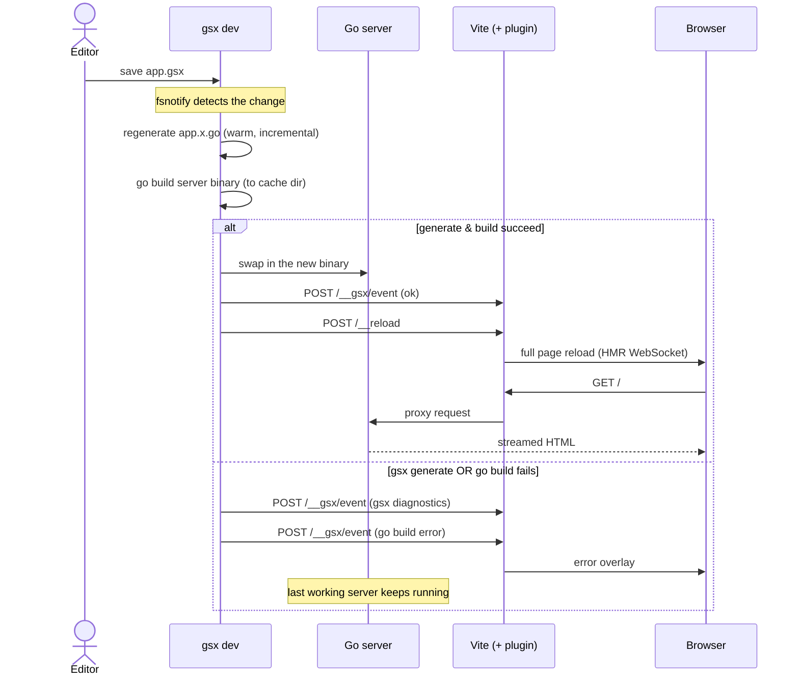

# Dev loop

`gsx dev` watches the project, keeps the Go server current, and reloads the
browser. The generated starter runs it with `npm run dev`.

## Run it

```sh
npm run dev
```

Open the URL printed in the terminal and leave the command running while you
edit the project.

## What happens on save

On a normal `.gsx` save, gsx runs this sequence:



Other project files have slightly different behavior:

- A `.go`, `go.mod`, or `go.sum` change refreshes affected generation, then
  rebuilds and reloads.
- A `.env` change restarts the existing backend with fresh environment values,
  then reloads. It does not regenerate or rebuild.

## When a build fails

After the server has built successfully once, generation and build errors from
later save cycles appear in the browser overlay, and the last working server
remains active. Fix the error and save again to build and reload the new version.

### The first build

Before the first successful build, there is no last working server. Keep
`gsx dev` running, fix the startup error, and save again.

## Dev panel

Press **Cmd-D** (macOS) or **Ctrl-D** to toggle a browser overlay showing live
dev-loop status: phase, Go server health + port, last cycle result, and
front-door state. The toggle is suppressed while focus is in an input,
textarea, or contenteditable element.

Existing apps (scaffolds already have it) add `import "virtual:gsx-devpanel";` to their Vite client entry.

Two buttons:

- **Rebuild** - forces a full regenerate → build → restart → reload, skipping
  the warm incremental path.
- **Restart server** - restarts the Go server only; no rebuild.

The front door (Vite) auto-restarts if it exits unexpectedly, backing off
500ms/2s/5s; three failed attempts and `gsx dev` gives up and suspends browser
pushes until you restart it. A respawned front door must answer with `gsx
dev`'s own `x-gsx` header before pushes resume, so a reconnect never targets
some other process that grabbed the port.

Under `--no-web` the panel still works against an externally run Vite; the
front-door row reads `external` since `gsx dev` isn't managing that process.

## Customize the commands

Use the [`gsx dev` flags](./cli.md#gsx-dev) for one-off changes to the front
door, build, run, or logging commands. Put persistent settings in the
[`[dev]` section of `gsx.toml`](./config.md#dev-development-loop).
