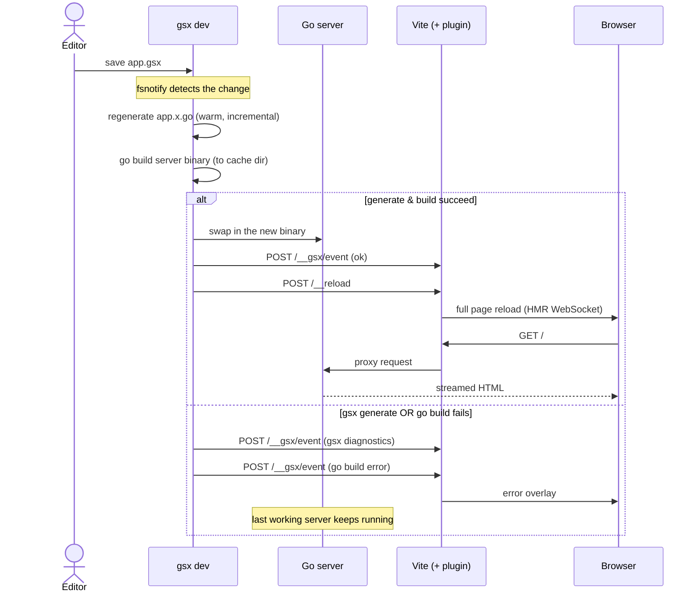

# Dev loop

`gsx dev` watches the project, keeps the Go server current, and reloads the
browser. The generated starter runs it with `npm run dev`.

## Run it

```sh
npm run dev
```

Open the URL printed in the terminal and leave the command running while you
edit the project.

## What happens on save

On a normal `.gsx` save, gsx runs this sequence:



Other project files have slightly different behavior:

- A `.go`, `go.mod`, or `go.sum` change refreshes affected generation, then
  rebuilds and reloads.
- A `.env` change restarts the existing backend with fresh environment values,
  then reloads. It does not regenerate or rebuild.

## When a build fails

After the server has built successfully once, generation and build errors from
later save cycles appear in the browser overlay, and the last working server
remains active. Fix the error and save again to build and reload the new version.

### The first build

Before the first successful build, there is no last working server. Keep
`gsx dev` running, fix the startup error, and save again.

## Dev panel

Press **Cmd-D** (macOS) or **Ctrl-D** to toggle a status overlay with two
buttons:

- **Rebuild** — full regenerate → build → restart → reload.
- **Restart server** — restart the Go server only.

Scaffolds ship it; existing apps add one line to their Vite client entry:

```js
import "virtual:gsx-devpanel";
```

(requires `@gsxhq/vite-plugin-gsx` ≥ 0.5.0; auto-show and the log box need ≥ 0.10.0). Disable it or rebind the key in
`vite.config.ts`: `gsx({ devPanel: false })` or
`gsx({ devPanel: { key: "k" } })`.

The panel also auto-appears on its own once a cycle runs past about 3
seconds, so a slow rebuild surfaces without reaching for Cmd-D — tune the
delay or turn it off with `gsx({ devPanel: { autoShow: 5000 } })` or
`{ autoShow: false }`. While it's up, it shows the running phase with
elapsed time and the last cycle's duration, and — when `[dev].log` is set —
tails the backend log so you can watch build and server output without
leaving the browser.

If Vite crashes, `gsx dev` restarts it automatically and pairs with the new
process before trusting it again (plugin ≥ 0.7.0 — older plugins just suspend
reload/overlay pushes instead) — refresh any tabs that were already open.

## Customize the commands

Use the [`gsx dev` flags](./cli.md#gsx-dev) for one-off changes to the front
door, build, run, or logging commands. Put persistent settings in the
[`[dev]` section of `gsx.toml`](./config.md#dev-development-loop).
