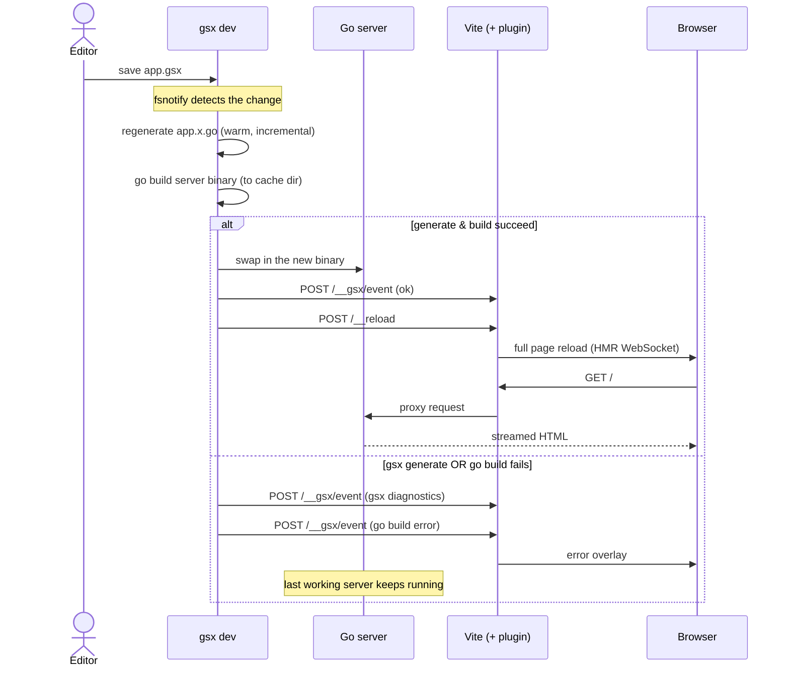

# Dev loop

`gsx dev` runs the whole development loop in a single warm Go process. It watches
your source, regenerates Go, rebuilds and safely swaps the server, and drives the
browser reload — so a server-rendered gsx app gets live reload from one command.

The generated starter runs it through `npm run dev`, which calls `go tool gsx dev`.
Because the HTML is rendered server-side, a reload is not a JavaScript hot-swap: it
inherently requires **regenerate → build → restart the server → reload the browser**.
`gsx dev` owns every step of that chain.

## The loop

## Step by step

1. **You save a file.** `gsx dev` watches `.gsx`, `.go`, and `.env` files. A change
   to any of them starts a cycle.
2. **Regenerate.** On a `.gsx` change, a warm `codegen.Module` regenerates the
   neighbouring `.x.go` in-process and incrementally. A change to a `.go` or `.env`
   file skips generation and goes straight to the rebuild.
3. **Rebuild.** `gsx dev` runs `go build` for the server binary into an
   operating-system cache directory — not your working tree, which keeps only the
   generated `.x.go` files beside their `.gsx` sources.
4. **Swap, don't stop.** Only if the build succeeds does `gsx dev` swap in the new
   binary. This *build-then-swap* order means a broken build never takes the running
   app down: the last working server keeps serving.
5. **Reload.** Once the new server is ready, `gsx dev` notifies the Vite plugin. It
   POSTs the codegen result (which drives the error overlay), then POSTs a reload
   event. Vite broadcasts a full page reload over its HMR WebSocket — posting *after*
   the server is ready is what keeps the reload from racing a stale binary.
6. **Render.** The browser re-requests the page. Vite proxies non-asset routes to the
   Go server, which streams the HTML rendered from the freshly generated `.x.go`.

## When something fails

The error overlay is event-driven: **both** kinds of failure stream to the same
`/__gsx/event` endpoint as error text in the POST payload.

- A **gsx generation error** (a parse or type error in a `.gsx` file) is posted as a
  diagnostic — the overlay points at the exact source location.
- A **Go build error** (the regenerated code, or your own `.go` files, don't compile)
  is posted too — `go build` never replaces the running binary on failure, so the last
  working server stays up and the overlay shows the compiler error.

Either way the app keeps responding while you read the error. Fix it and save again:
the overlay clears and the rebuilt server replaces the last one.

### The initial build

The last-good-server guarantee only holds once a server has built at least once. If
the server fails to build on the **first** start, there is no previous binary to fall
back to, so the browser shows a generic "backend down" page rather than a source-level
overlay. `gsx dev` mirrors the server's build and run output to a log file
(`tmp/dev.log` in the starter, enabled with [`--log`](./cli#gsx-dev)), and the "backend
down" page tails it — so that first-build compiler error is visible there. If the log
file is absent, the page still shows, but with no log to display; enable the log to see
why the server did not build.

## Why one warm process

A cold `gsx generate` reloads the Go type environment on every run. `gsx dev` keeps
that environment warm, so an incremental regenerate drops from ~140 ms to ~1–2 ms on
a small package. Running generate, build, swap, and reload in one supervised process
also replaces the classic multi-tool setup — a generic file watcher, a separate
codegen watcher, and a log multiplexer — with a single command that tears down
cleanly.

See the [CLI reference](./cli#gsx-dev) for `gsx dev`'s flags, and
[Getting started](./getting-started) to scaffold a project and run the loop.
